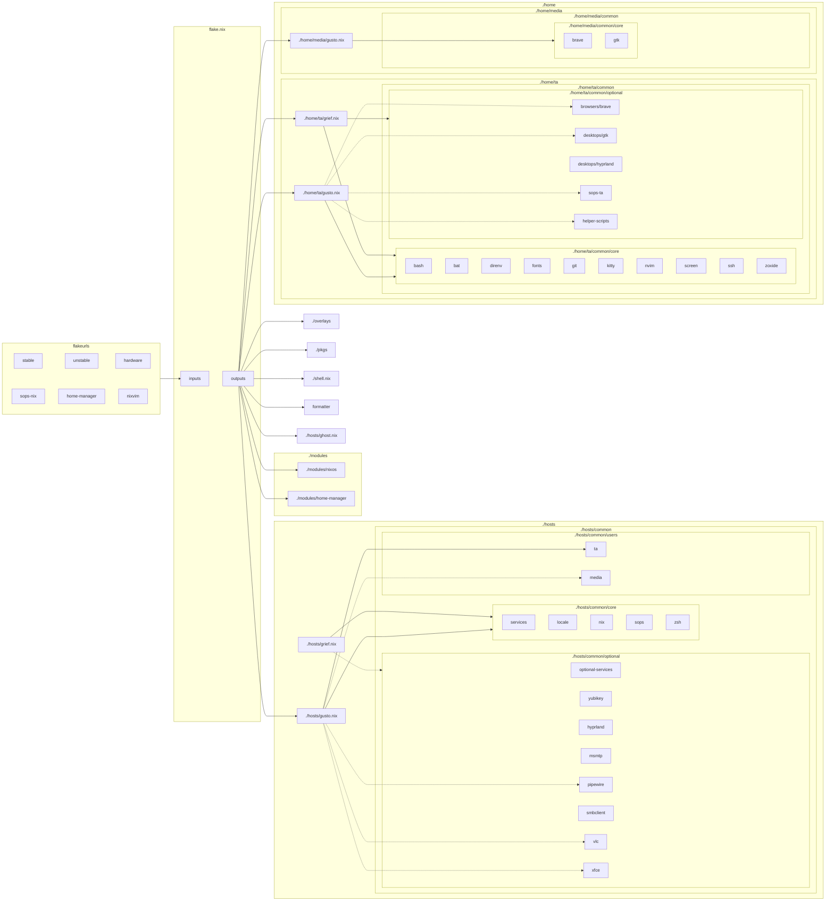

# Anatomy

[README](../README.md) > Anatomy

## Structural Concept
The following diagram depicts the conceptual anatomy of my nix-config. It is not an accurate representation of the current state but will be updated over time to represent additional elements and details as the config evolves.

## Details
For details about the design concepts, constraints, and how structural elements interact, see the article and/or Youtube video [Anatomy of a NixOS Config](https://unmovedcentre.com/technology/2024/02/24/anatomy-of-a-nixos-config.html) available on my website.

## Fugly visual of the current state as of Feb 25, 2024

The following diagram is a more accurate, albeit less visually appealing representation of the current state, written in mermaid syntax.

---
[Return to top](#anatomy)

[README](../README.md) > Anatomy
