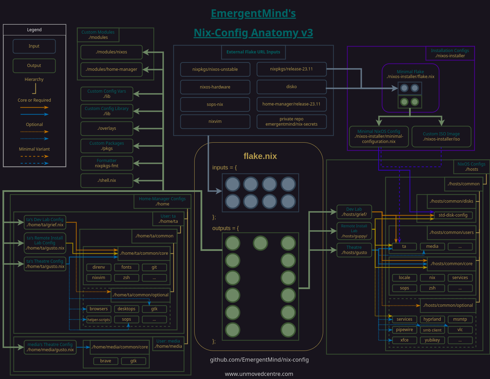
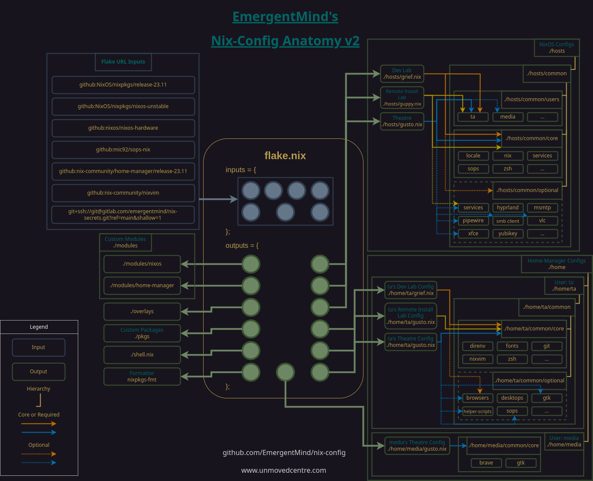
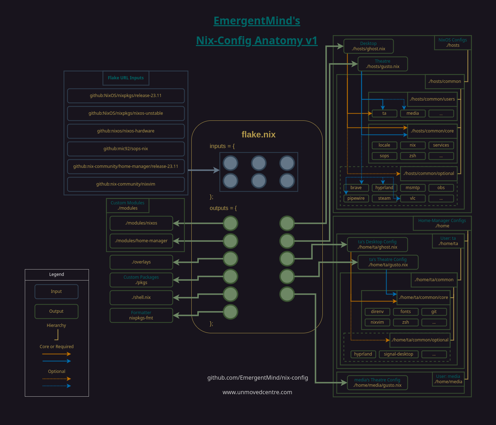

# Anatomy

[README](../README.md) > Anatomy

## Structural Concept

The following diagram depicts the conceptual anatomy of my nix-config. It is not an accurate representation of the current state but will be updated over time to represent additional elements and details as the config evolves.

## Details

For details about the design concepts, constraints, and how structural elements interact, see the article and/or Youtube video [Anatomy of a NixOS Config](https://unmovedcentre.com/posts/anatomy-of-a-nixos-config/) available on my website.

## Previous Iterations of the Structural Concept

---

[Return to top](#anatomy)

[README](../README.md) > Anatomy
