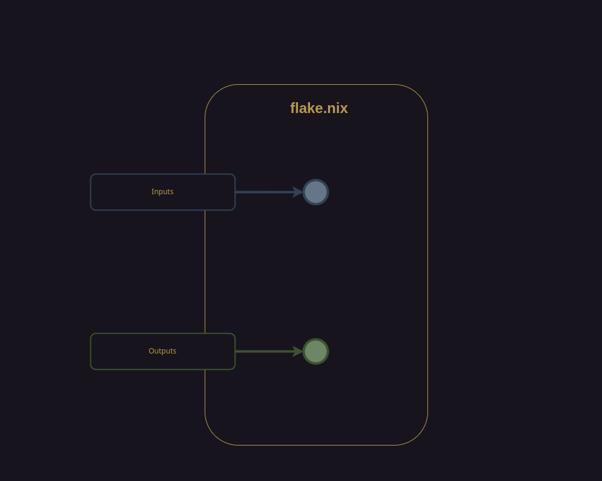
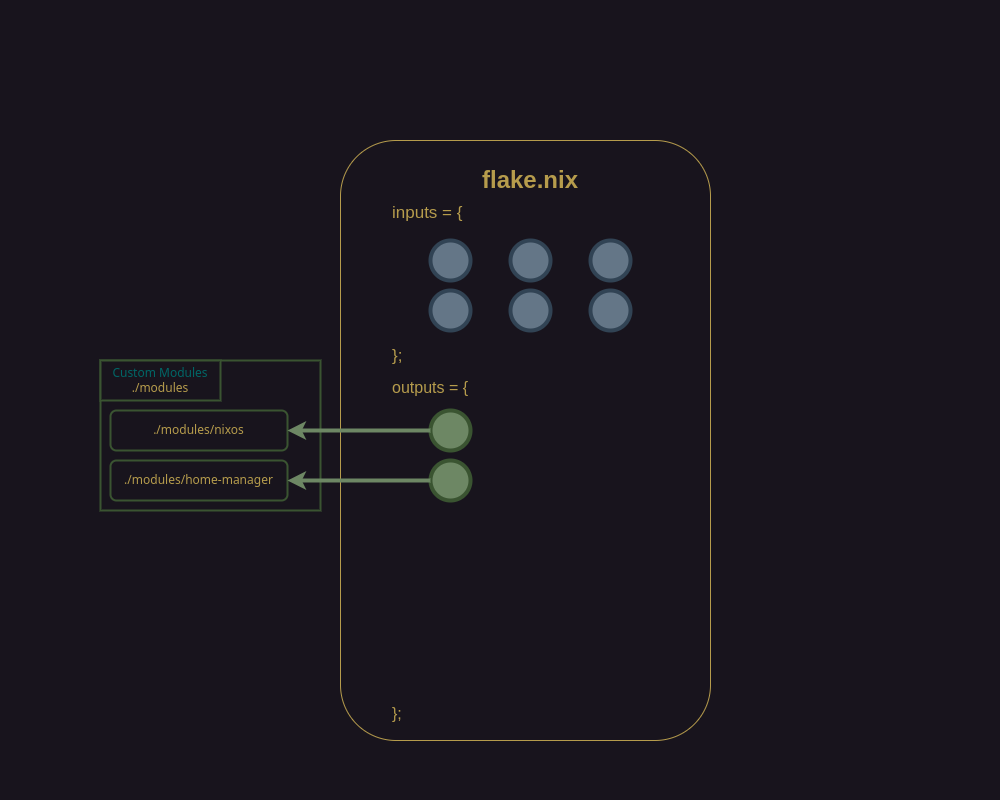
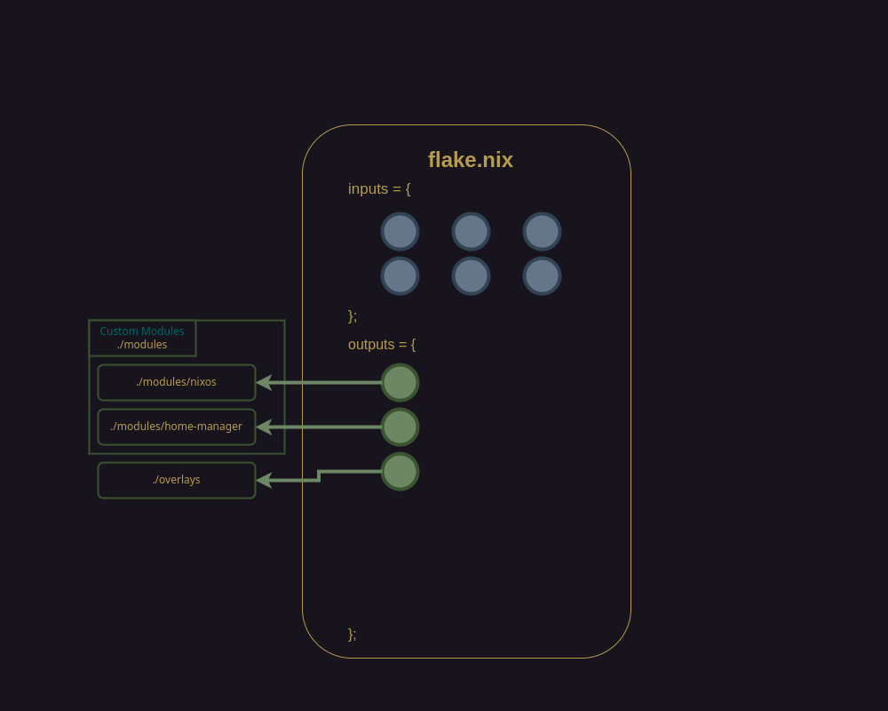
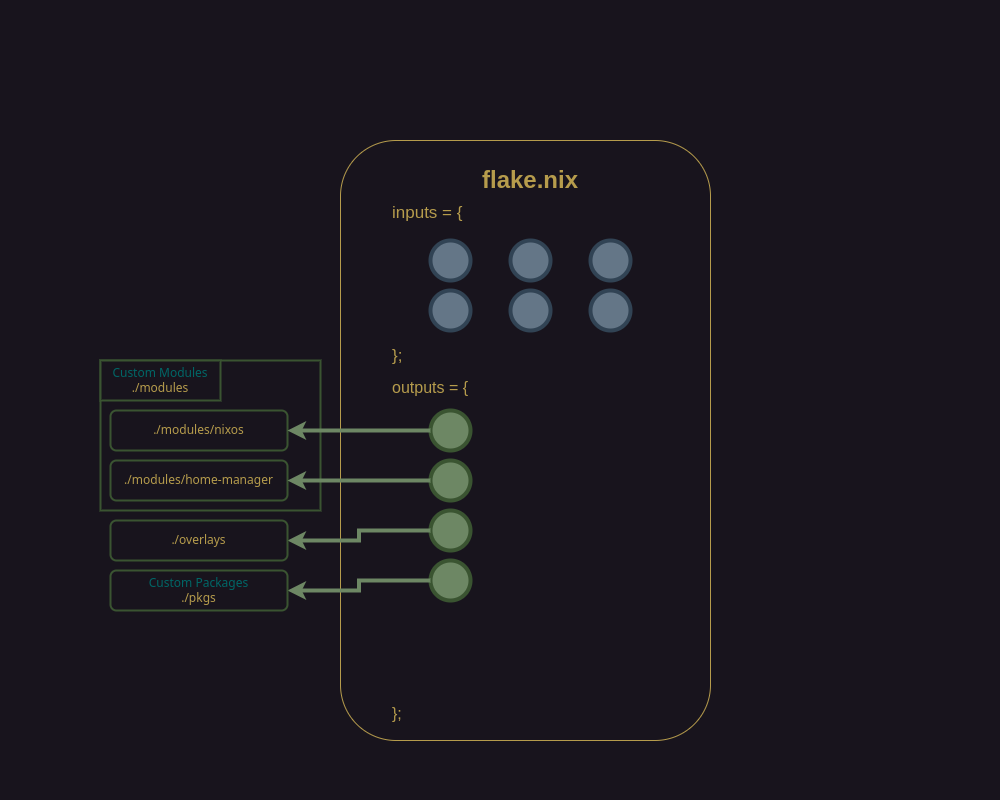
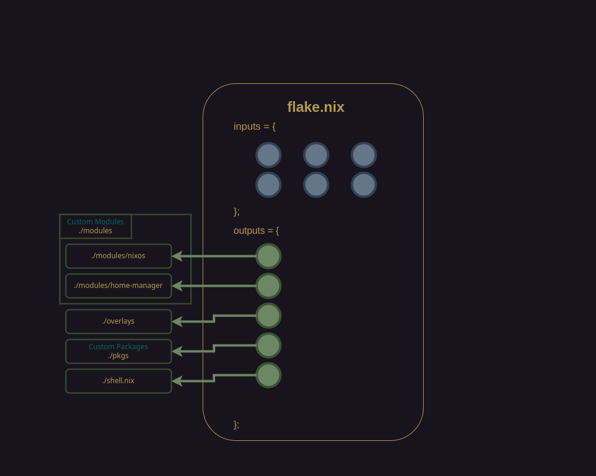
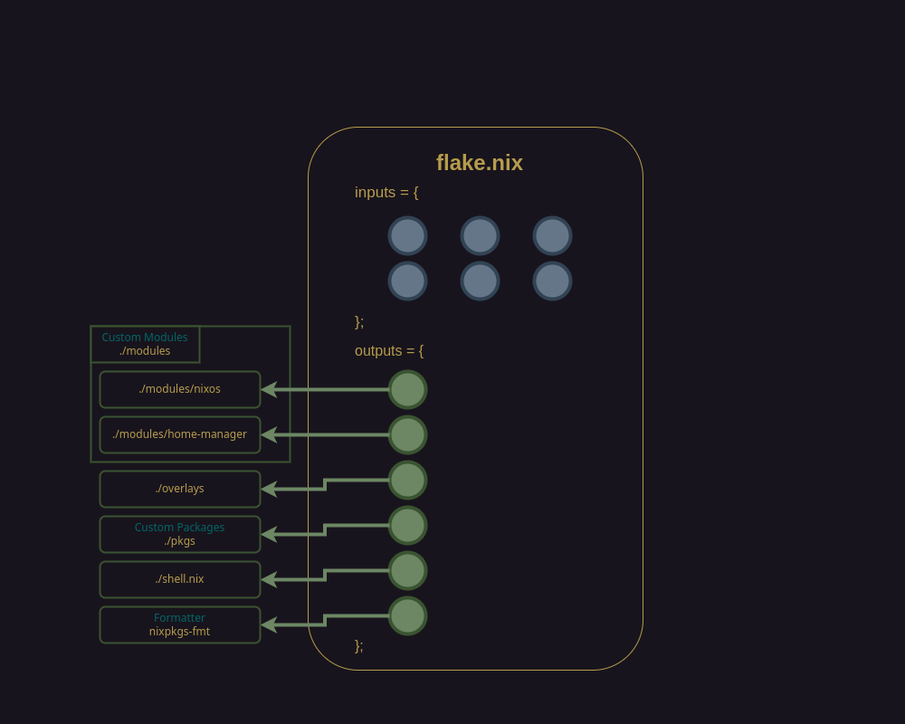
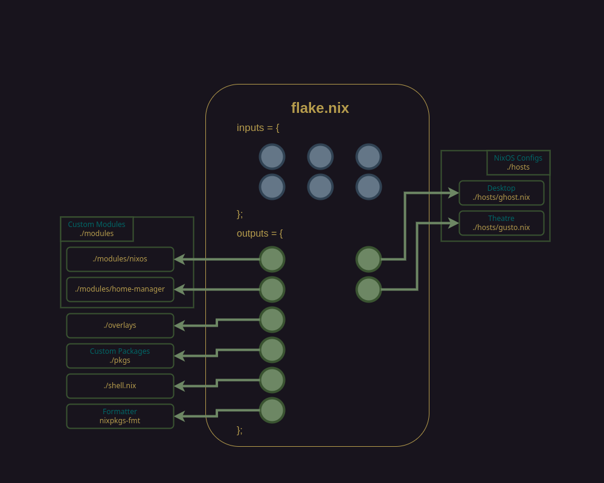
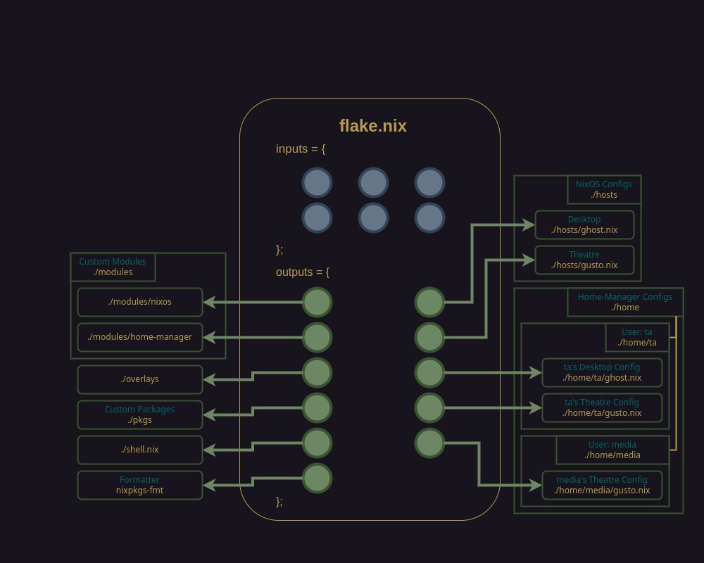
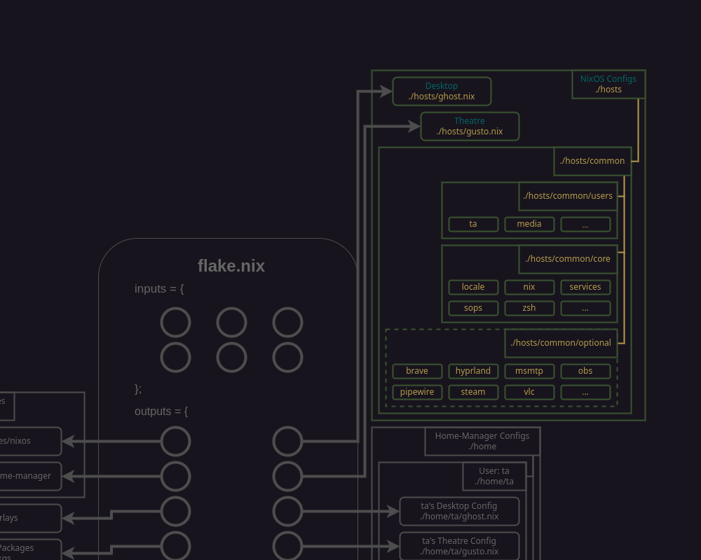
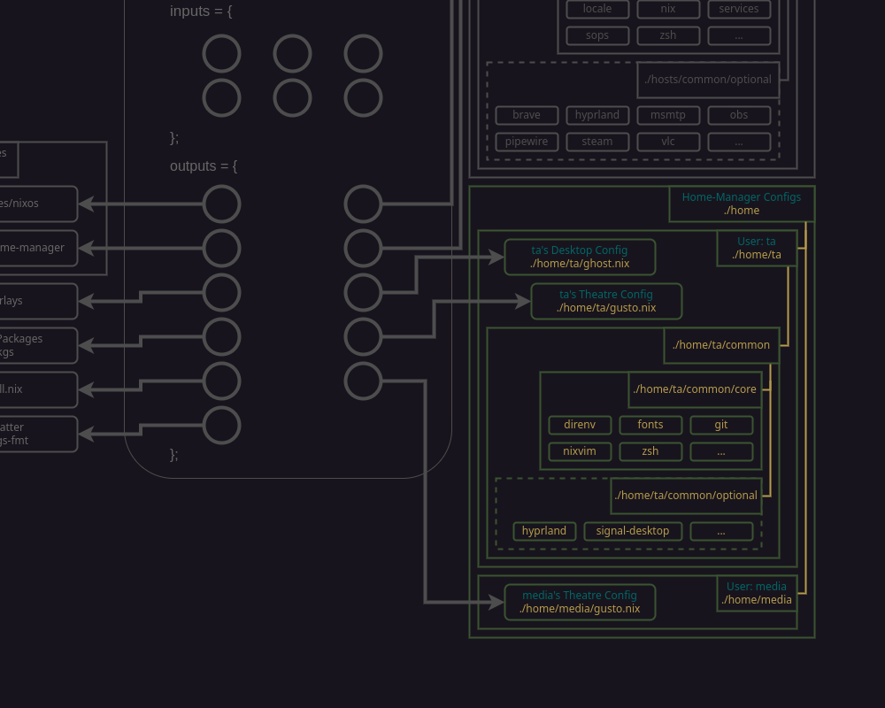

# Anatomy

[README](../README.md) > Anatomy

## Design Concepts and Constraints

* Favor readable and intuitive factors over efficiency factors
* Strive for modular repeatability
* Support commonalities across to hosts and users
* Strict Core vs Optional tolerance
  * If a config is present on _all_ hosts or user homes then it could be considered core otherwise it is optional

## Structural Elements

The term Nix-Config refers to the overall configuration defined by this entire repository. The terms config and configuration are used throughout to refer to context-specific configurations with-in the broader umbrella of the Nix-Config.

### flake.nix :snowflake:

This file connects external dependency sources and the internal structural elements that are used throughout the Nix-Config. It is the entry point to hosts and user home configurations for the Nix-Config.

External dependencies are specified in `flake.nix` as _inputs_ and can include URLs to sources like the official package management channels as well as other flakes that provide nix-specific flavors of package configurations or other utilities that we want to leverage, such as sops-nix for secrets management and nix-vim for a NixOS specific neovim distribution.

The rest of the `flake.nix` file consists of _outputs_ specifications that connect all of the internal elements of the Nix-Config that define the configuration for each host and user's home. The elements that make up _outputs_ in the Nix-Config are:

* Custom modules
* Overlays
* Custom packages
* Scripts
* A formatter
* A devshell
* Hosts
* Home

Some of these elements consist of their own substructures and vary greatly in terms of complexity.
  
### Custom Modules

Custom modules to enable special functionality for nixos or home-manager oriented configurations.

Path: `./modules`

#### nixosModules 

Path: `./modules/nixos`

#### homeManagerModules

Path: `./modules/home-manager`

### Overlays

Path: `./overlays`

Custom modifications to upstream packages.

### Custom Packages

Path: `./pkgs`

Custom packages meant to be shared or upstreamed.

### Scripts

> Not included in diagram

Path: `./scripts`

Custom scripts for automation. Ideally, most of these would become nixified and move elsewhere.

### Formatter

A cli nix formatting utility for helping to ensure well form nix expressions. Accessible using `nix-fmt`.

### DevShell

A custom nix-shell that includes packages required for development tasks and boostrapping. Accessible automatically when in the `nix-config` directory.

### Hosts  

Path: `./hosts`

Host or system-level NixOS configurations accessible via `sudo nixos-rebuild switch --flake .#[host]`.

Hosts configs handle package installation and configuration that is or is highly-likely to be common for all users.

### Home

Path: `./home/[user]` 

User-level Home-manager configurations accessbile via `home-manager switch --flake .#[user]@[host]`.

Home configs handle package installation and user preferences that are specific to a single user.

## Hosts-level Structural Details

  * `common` :globe_with_meridians: Shared configurations consumed by the machine specific ones.
    * `core` :syringe: Configurations present across all hosts. This is a hard rule! If something isn't core, it is optional.
    * `optional` :ballot_box_with_check: Optional configurations present across more than one host.
    * `users` :busts_in_silhouette: Host level user configurations present across at least one host.
  * `genoa` :briefcase: stage 3
  * `ghost` :ghost: stage 4
  * `grief` :microscope: Lab VM
  * `gooey` :honey_pot: stage 5
  * `gusto` :movie_camera: Theatre

## Home-level Structural Details

  * `common` :globe_with_meridians: Shared home-manager configurations consumed the user's machine specific ones.
    * `core` :syringe: Home-manager configuartions present for user across all machines. This is a hard rule! If something isn't core, it is optional.
    * `optional` :ballot_box_with_check: Optional home-manager configurations that can be added for specific machines. These can be added by category (e.g. options/media) or individually (e.g. options/media/foo.nix) as needed.
    The home-manager core and options are defined in host-specific .nix files housed in `home/[user]`.

## Putting it all together

---
[Return to top](#anatomy)

[README](../README.md) > Anatomy
