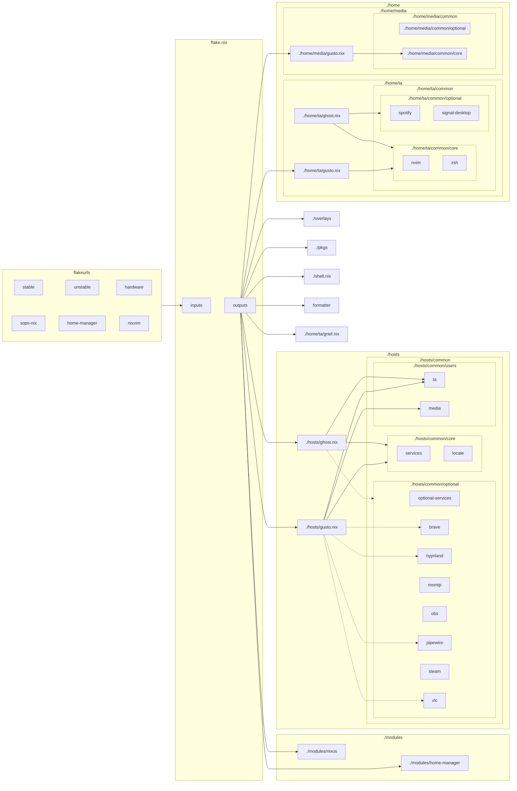

# Anatomy

```mermaid

flowchart LR

  subgraph flakeurls
    stable ~~~ sops-nix
    unstable ~~~ home-manager
    hardware  ~~~ nixvim
  end

  subgraph flake.nix
    inputs ~~~ outputs
  end

  subgraph ./modules
    ./modules/nixos ~~~ ./modules/home-manager
  end

  subgraph ./hosts
    ./hosts/ghost.nix
    ./hosts/gusto.nix
    subgraph ./hosts/common

      subgraph ./hosts/common/core
      services
      locale
      end 

      subgraph ./hosts/common/optional
      optional-services
      brave
      hyprland
      msmtp
      obs
      pipewire
      steam
      vlc
      end  

      subgraph ./hosts/common/users
      ta
      media
      end

    end
  end

  subgraph ./home
    subgraph ./home/ta
      ./home/ta/ghost.nix
      ./home/ta/gusto.nix
      subgraph ./home/ta/common
        subgraph ./home/ta/common/core
          nvim
          zsh
        end
        subgraph ./home/ta/common/optional
          spotify
          signal-desktop
        end
      end
    end
    subgraph ./home/media
      ./home/media/gusto.nix
      subgraph ./home/media/common
        subgraph ./home/media/common/core
        end
        subgraph ./home/media/common/optional
        end
      end
    end
  end


  flakeurls --> inputs
  outputs --> ./modules/nixos
  outputs --> ./modules/home-manager 
  outputs --> ./overlays
  outputs --> ./pkgs
  outputs --> ./shell.nix
  outputs --> formatter
  outputs --> ./hosts/ghost.nix
  outputs --> ./hosts/gusto.nix
  outputs --> ./home/ta/grief.nix
  outputs --> ./home/ta/gusto.nix
  outputs --> ./home/media/gusto.nix

  ./hosts/ghost.nix --> ta
  ./hosts/ghost.nix --> ./hosts/common/core
  ./hosts/ghost.nix -.-> ./hosts/common/optional

  ./hosts/gusto.nix --> ta
  ./hosts/gusto.nix --> media
  ./hosts/gusto.nix --> ./hosts/common/core
  ./hosts/gusto.nix -.-> brave
  ./hosts/gusto.nix -.-> hyprland
  ./hosts/gusto.nix -.-> pipewire
  ./hosts/gusto.nix -.-> vlc

  ./home/ta/ghost.nix --> ./home/ta/common/core
  ./home/ta/ghost.nix --> ./home/ta/common/optional
  ./home/ta/gusto.nix --> ./home/ta/common/core

  ./home/media/gusto.nix --> ./home/media/common/core

```